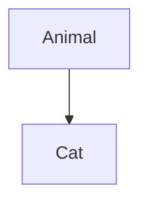

> This is a _dummy article_ in which I am using for testing out new functionalities, please kindly ignore this page. **Thanks**.

## Opening

This is some more info Lorem ipsum dolor sit amet consectetur adipisicing elit. Natus, illo asperiores, ipsa hic optio vitae architecto odio mollitia quia tempore dolores officia nam id molestiae cupiditate officiis iste at vero?

### Abstract

This ~is some~ more info [hello](http://somelink.com). 内容あんま読んでないから自信ないけど

### Preview

This is some more info `Some(_)` is cool as well

### Equation

- Schrödinger equation

$$
i \hbar \frac{\partial}{\partial t} \Psi \big(\textbf{r}, t) = \left[- \frac{\hbar^2}{2m}\nabla^2 + V(\textbf{r})\right]\Psi(\textbf{r}, t)
$$

- Matrices

$$
\begin{pmatrix*}[r]
    -1 & 2 & 3 \\
    4 & -5 & 6 \\
    7 & 8 & -9
\end{pmatrix*}
$$

## Chapter 2

<v-img src="deserted-place.jpg" alt="deserted place" caption="Figure 1: Random Destroyed Territory, Captioned."></v-img>

This is some more info
**Hello** _world_ **hahaha**

> This is cool



Mermaid graph does not work in here 😥

```rust{1-2,8}[lib.rs]
#[pallet::config]
pub trait Config: frame_system::Config {
    type Event: From<Event<Self>> + IsType<<Self as frame_system::Config>::Event>;
    type MaxBytesInHash: Get<u32>;
}

#[pallet::event]
#[pallet::generate_deposit(pub(super) fn deposit_event)]
pub enum Event<T: Config> {
    ClaimCreated(T::AccountId, BoundedVec<u8, T::MaxBytesInHash>),
    ClaimRevoked(T::AccountId, BoundedVec<u8, T::MaxBytesInHash>),
}
```

```diff
#include <iostream>

- using namespace std;

int main() {
- cout << "hello" << endl;
+ std::cout << "hello" << std::endl;

  return 0;
}
```

## Chapter 3

- item 1
- item 2
  - item 2.1
  - item 2.2
- item 3

Here's a simple footnote,[^1] and here's a longer one.[^bignote]

[^1]: This is the first footnote.
[^bignote]: Here's one with multiple paragraphs and code.

    Indent paragraphs to include them in the footnote.

    `{ my code }`

    Add as many paragraphs as you like.

```cs
using System.Collections.Generic;

namespace MainProj
{
    class Program
    {
        public static void Main(string[] args)
        {
            Console.WriteLine("Hello");
        }
    }
}
```
